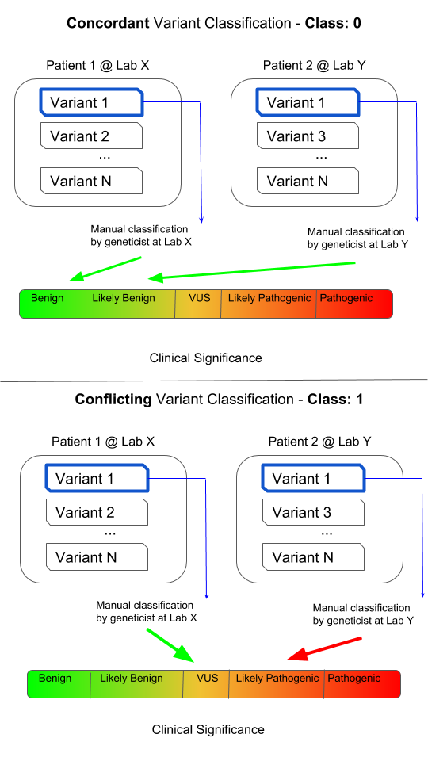

# Genetic-Variant-Classifications-using-Deep-Learning

Predict whether a variant will have conflicting clinical classifications.

# Context
ClinVar is a public resource containing annotations about human genetic variants. These variants are (usually manually) classified by clinical laboratories on a categorical spectrum ranging from benign, likely benign, uncertain significance, likely pathogenic, and pathogenic. Variants that have conflicting classifications (from laboratory to laboratory) can cause confusion when clinicians or researchers try to interpret whether the variant has an impact on the disease of a given patient.

# Content
The objective is to predict whether a ClinVar variant will have conflicting classifications. This is presented here as a binary classification problem, where each record in the dataset is a genetic variant.

Conflicting classifications are when two of any of the following three categories are present for one variant, two submissions of one category are not considered conflicting.

Likely Benign or Benign
VUS
Likely Pathogenic or Pathogenic
Conflicting classification has been assigned to the CLASS column. It is a binary representation of whether or not a variant has conflicting classifications, where 0 represents consistent classifications and 1 represents conflicting classifications.

# Acknowledgements
Landrum MJ, Lee JM, Benson M, Brown GR, Chao C, Chitipiralla S, Gu B, Hart J, Hoffman D, Jang W, Karapetyan K, Katz K, Liu C, Maddipatla Z, Malheiro A, McDaniel K, Ovetsky M, Riley G, Zhou G, Holmes JB, Kattman BL, Maglott DR. ClinVar: improving access to variant interpretations and supporting evidence. Nucleic Acids Res. 2018 Jan 4. PubMed PMID: 29165669.
